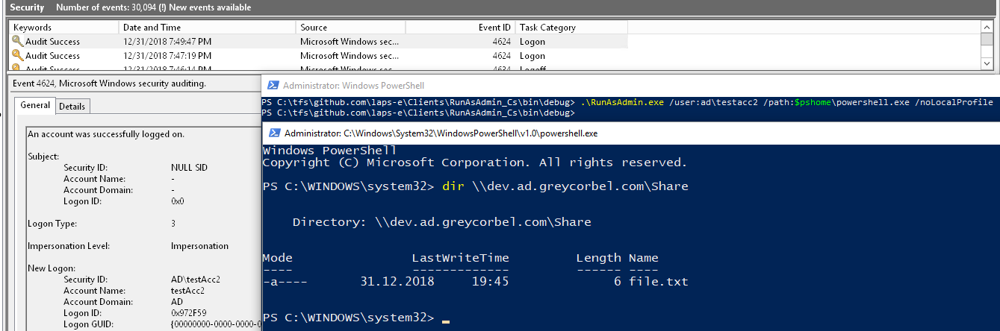

# Managed Domain Accounts
Managed domain accounts is feature of AdmPwd.E solution that allows automatic password management of domain user accounts. At the same time, it provides secure password retrieval and reset with ability to specify who can read and reset password.

Typical use case of this feature is management of personal, secondary accounts that are not used as primary accounts to log on to users' desktops, but rather used ad-hoc to perform management tasks on applications or infrastructure.

Main design goal for managed domain account was to provide toolset that allows easy, secure and audited password retrieval for authorized users, while keeping password in on-premises infrastructure. Nowadays, users often use personal vaults to store company credentials, and company has limited control over security of such credentials. Also, users leaving company often take passwords of sensitive accounts with them in their personal vaults, increasing the risk of misuse of such credentials.  
With Managed Domain Accounts, AdmPwd.E provides password of managed domain accounts to authorized user on demand, while keeping them really random and complex. This means that users do not need to store them in personal password vaults - instead just reach for password, whenever they need it. PDS makes sure that password is regularly changed according to configured age and complexity criteria.

## Configuration
Configuration of Managed Domain Accounts is done in PDS configuration file, in section `ManagedAccounts`. You configure OU's or containers where PDS looks for user accounts, and managed password on accounts found here.

Prerequisite is to delegate appropriate permissions to PDS service account via `Set-AdmPwdPdsManagedAccountsPermission`.

Sample configuration looks like this:
```xml
  <ManagedAccounts passwordManagementInterval="600">
    <containers>
      add 
        distinguishedName="OU=MyManagedAccounts,DC=ad,DC=mydomain,DC=com" 
        passwordAge="86400" 
        keyId="1" 
        passwordComplexity="LargeSmallNumSpec" 
        passwordLength="12" 
        passwordHistory="false" 
        passwordHistoryLength="3"
      />
    </containers>
  </ManagedAccounts>
```

Configuration above says:
* Manage password on user accounts found in container `OU=MyManagedAccounts,DC=ad,DC=mydomain,DC=com`
* For each account found, change password every 60 days (86400 minutes)
* When generating password, generape password 12 chars long, that contains Large and Small character, Numbers, and Special Characters
* Encrypt the password in AD using encryption key with ID=1
* Do not maintain password history

## Usage
Authorized users (those who were granted `Read admin password` permission with PowerShell cmdlet `Set-AdmPwdReadPasswordPermision`) can use password by the following ways:
* Read the password via PowerShell cmdlet `Get-AdmPwdManagedAccountPassword`
* Use one of the tools that retrieve and use password automatically

Usage of tools integrated with AdmPwd.E for automatic retrieval of password of Managed Domain Account has a benefit that user does not need to deal with password at all: tool automatically uses it as needed.

Printscreen below demonstrates this on the following scenario:
* User uses tool RunAsAdmin to retrieve password of account AD\testAcc2 and use it to start new process
* Process stated is configured to use account for network operations only - local profile is not created for account AD\testAcc2, and password is not cached at all
* Still, user has ability to reach to server in security context of account AD\testAcc2 and list content of the share
* All this happened without the need to know and type the password - user has just been granted permission to retrieve password of Managed Domain Account!

Usage:  
`RunAsAdmin.exe /user:<username> /path:<path to executable to run> [/NoLocalProfile]`

[](../../../../images/Operations/User/managed-domain-account-runas.png)