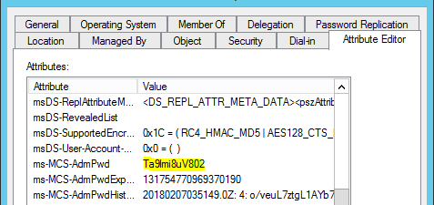
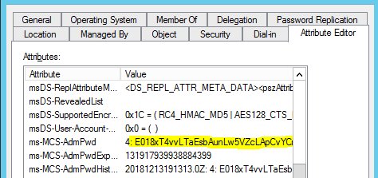
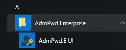
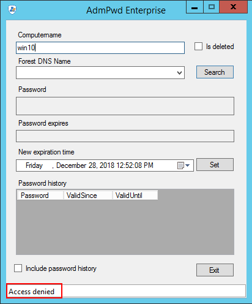
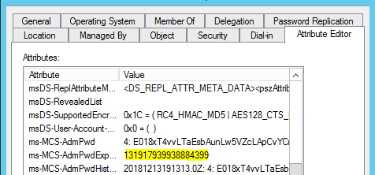
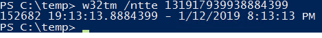

# Password of managed local admin account


## Viewing password settings in Active Directory Users and Computers
Once everything is configured, and Group Policy has refreshed on the clients, you can look at the properties of the computer object and see the new settings. The password can be stored encrypted or unencrypted. Encrypted passwords contain a keyID prefix.



*Example*: Plain text Password as stored in AD



*Example*: Encrypted Password stored in AD and enrypted by key with ID = 4

## Using Fat Client UI

Fat Client UI is a graphical interface available (Fat Client) that can be installed standalone, in a network share or as an add-in to Active Directory Users and Computers. You can find it in Start screen / menu:


What happens if a user who hasn’t been granted rights to see the local Administrators password tries to access it? If they were to gain access to the GUI interface the password won’t be displayed.  They are also given an Access Denied message.



*Note*: If they have installed the RSAT tools and run Active Directory Users and Computers (ADUC) to view the password it will show as <not set>. 

*Note*: Even for users with permissions to read the content of the attribute `ms-MCS-AdmPwd` (event members of Domain Admins) it is not possible to know the passowrd directly in AD as long as password is stored encrypted - They can only see encrypted value for password rather than actual password. This is a great advantage compared to Microsoft LAPS: Password encrzption significantly decreases the chance for password leak due to permission misconfigurations.

This information is not seen because only the Decryption Service can read the password. Membership in the Password Readers group tells the service that it is allowed to reveal the password to the user.

## Password Expiration Time
The Expiration time is stored as the number of 100-nanosecond intervals that have elapsed since the 0 hour on January 1, 1601 until the date/time that is being stored. The time is always stored in Greenwich Mean Time (GMT) in the Active Directory.



If you want to manually convert it use this command:

`w32tm /ntte <number you want to convert>`




## Retrieving passwords with PowerShell
You can also get the password using PowerShell. You may need to run Import-module AdmPwd.PS if this is a new window.

This command retrieves password for a computer and shows password history:
``` PowerShell
Get-AdmPwdPassword -ComputerName <computername> -IncludeHistory | select -expand PasswordHistory
```

Passwords can also be retrieved from deleted computer accounts:

``` Powershell
Get-AdmPwdPassword -ComputerName <computername> -IsDeleted
```

*Note*: Retrieval of password from deleted computer object can only currently be done through PowerShell.
